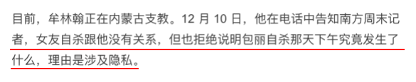
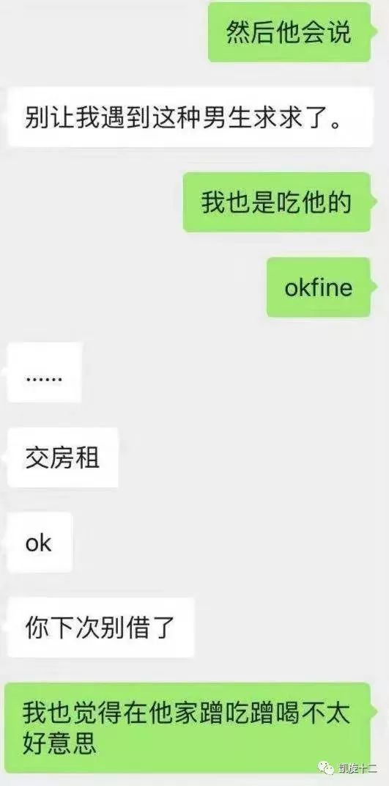
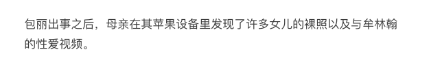
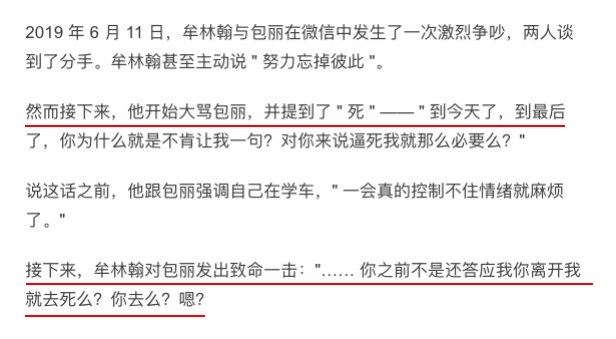

### 北大自杀女生的聊天记录里，真相不寒而栗！

卓绝  周冲的影像声色  Today

> 今年8月初，
包丽问母亲：
“妈妈，我有一个同学，
她跟男朋友分手，男朋友说要自杀，这个问题怎么解决？”

> 母亲以为是别人的事，
敷衍几句，就没有再聊下去。
但她万万没想到，
这个故事的女主角，
其实就是自己的女儿。
——《南方周末》

#### 1

2019年10月9日下午六点左右，
北大女生包丽进入了一家酒店。

半小时后，
她网上订购的2盒药，也送到了。
在随后一个小时内，她做了三件事。

第一件，给妈妈打了个电话，
电话里，她称呼母亲为“妈咪”，
很亲呢，
也很少见。
但母亲并未警惕。

第二件，给男朋友牟林翰（她备注牟林翰为“主人”，牟林翰有时称她“狗狗”，有时叫她“妈妈”）发了3条微信，
内容分别是：
> 此生最遗憾的事情莫过于此了。
遇到了熠熠闪光的你而我却是一块垃圾。
妈妈今天给你谢罪了。

第三件，服药。
晚上7:13分，她尚有意识，更新最后一条微博：
我命由天不由我。
而此微博设为“仅自己可见”。

在此之后，
包丽再也没有醒过来。
一个月前，医院通知：病人已脑死亡（脑死亡不可逆转）。

对于这起悲剧，
南方周末曾进行深度采访和报道。
新闻原稿上写道：

> 她看了女儿与男友牟林翰的微信聊天记录，
认为找到了女儿轻生的真相。
" 我很想跑过去把他（牟林翰）捅死。"
包丽母亲这样形容她看到聊天记录时的愤怒。

而牟林翰呢。
他正以一个有为青年的身份，
前往内蒙支教。
当记者拨通他的电话后，
牟林翰的回答是——
女友的自杀，与他没有关系。

___
#### 2

包丽是一名北大法学院大三的学生。
颜值高，性格温和，
家庭条件也不错。
如果不是因为遇见了牟林翰，
她前途似锦，
未来不可限量。

但可惜，
她遇见了这个擅于精神操控的恶魔，牟林翰。

牟林翰。
北大2015届政府管理系学生。
大家记得这张脸。
不要忘记！

打码？
我帮你打个鬼的码！

他是北大2015届政府管理学院学生。
是学生会副主席。
有权力欲。
心机极深。
手段极恶劣。
疑似PUA。
非常变态，非常可恨，非常暗黑，非常可怕......

他的履历如此漂亮。
以至于在包丽事件曝光后，
依然有人不敢相信，
与他热情沟通。

他把自己包装成一个有为青年，
阳光、积极、上进，
未来一片光明。

包丽说，他是“北大刘昊然”。
可见她对他的认可。

2018年，包丽参加学生会主席竞选，
牟林翰一直在背后，
为其出谋划策。

后来，包丽竞选虽落了榜。
但与牟林翰却走到了一起。

牟林翰是包丽第三任男友。
在恋爱期间，
包丽曾告诉同学：
我喜欢牟林翰，因为我们一切都太合适了。

从外在条件看，他们也确实合适。
包丽漂亮，牟林翰也过得去。
包丽家境好，牟林翰家里超有钱。
包丽是文艺部部长，牟林翰是体育部部长。
但匹配的条件，
却没有带来好的爱情。

就在他们在一起的第二天，两人便引发了争吵。
主要原因是，
牟林翰接受不了包丽不是处女。

而在以后的日子里，
他依然天天强调，
“你把最美好的东西奉献给了另一个人。”
“而我却要为你的决定不断地麻痹自己，不断地在痛苦中轮回。”
......

他是校辨论队的。
诡辨能力超强。
包丽根本无法说服他。

他以不断强调、偷换概念等方式，
令包丽渐渐放弃自我，
接纳他的价值观，
觉得自己卑贱、不自重、太自私......
愧疚得无以复加。

“我不想当一个接盘的人。”
“你的第一次，是给你前男友的认可和奖励。”
“我就像个可怜鬼。”
......

最开始时，
包丽并不接受这种观念。
她此时还有理智，
认为“最美的东西是自己的未来”。

但经不起牟林翰不断强调魔鬼逻辑：
“女孩结婚前就应该是处女，否则就是犯了大错，否则就应该对男友做出补偿。”

最后她也对此开始抱憾。

人有着与生俱来的被认可欲，
当我们与一个人交往，
都会有磨合，
有退让，
以获得他人的认可。

而善于精神控制的人，
就会利用这种“退让”，
将你一点一点地洗脑，
最终唯他是从。

但他们的关系是失衡的。
牟林翰要求包丽忠贞，
他却一点也不洁身自好。
和包丽交往期间，
牟林翰经常骚扰自己的前女友。

但包丽却在他的控制里，
动弹不得，
一点一点地迷失和沦落。

牟林翰的行为，
让我想起了PUA里的一些套路。

之前因揭秘PUA需要，
我也买了一份泡学教程。
有一章叫关于“如何调教女友”，
其中一个步骤就是：
利用男人的处女情结。

该PUA导师还表示：
引发愧疚感，
是击破对方心理防线最关键的一步。
“她没有愧疚感，
你嘴皮子磨破了，
嗓子喊哑了，
也调教（控制）不了女友啊。”

牟林翰，深谙此招。
他以强调自己的痛苦，
来加深包丽的内疚：
我这人占有欲很强；
我不想有人动过我的女孩；
我凭什么命这么差，连个完整的女孩都不曾得到；

包丽入套了。
经过男友不间断的施压后，
她最初的信仰“我最美好的东西是我的将来”，
终被修改为“最美好的东西，是女人的第一次。

但这个“最美好的东西”，她没有。
所以，
她被牟林翰推入了人生的黑夜。

___
#### 3
PUA五步陷阱里面，
其中有一步，
叫做“诱惑的危险”。

导师说，
把女友变成“宠物”，
其实就是一个训狗术的过程。

当她做了不应该做的事，
我们就用情感指责去打压，
让“宠物”产生委屈、自责等等一系列情绪。

举个例子。
女生不小心迟到了20分钟。
泡男就会反复指责：
“我提前1小时就到，你却迟到这么久，你根本就是不在乎我！”

当谴责挂以“爱不爱”、“在不在乎” 的名义，
那么，
女生就很容易陷入一种自我怀疑的情绪。

PUA导师说，
洗脑就是用你的情绪，
来操控对方的情绪，
从而达到操控效果。

牟林翰也是这样。
在包丽承认自己的“不完美”之后，
牟林翰便抓住这一点，
疯狂进行精神打压。

比如，和前男友交往期间，
包丽曾去过两次前男友宿舍。
牟林翰知道后，
先是以指责的口吻，盘问具体细节。

然后便是肆意的谩骂和贬损。
从聊天记录上看，
一直被贬低、被指责的包丽，
似乎连反抗的力气都没有了。

为把包丽的自责感推到极点，
他开始问包丽与前男友的性爱细节。

同时，
对于回答是否全面、真实，
还要求包丽发誓保证。

这便是使包丽走向低自尊，
低价值感的过程。

强调处女情结，
是一种放大。
逼包丽描述和前男友性爱细节，
这也是一种放大。

包丽10分的愧疚，
终演变为100分的罪恶和悔恨。

2019年2月4日，
包丽对朋友说：
“以前觉得我不会为做过的事后悔，
可我现在好后悔。”

后悔，自责，罪恶，
这些如铅一般重的情绪，
足以摧毁一个人的自我——尤其在亲密关系里。

包丽的自我，被毁了。
在牟林翰的要求下，
包丽称呼男朋友为“主人”。
牟林翰称呼她为“狗”。

牟林翰还曾要求包丽为其纹身。

纹身内容是：
我是牟林翰的狗。

___
#### 4 把包丽驯化成“宠物”之后 骗钱，虐待，拍裸照，要求切除输卵管

牟林翰的獠牙，露出来了。
在与包丽交往期间，
他会同时进行两件事。

一个是精神虐待包丽。

另一个是借钱。
陆陆续续，
牟林翰问女友伸手借了2万多。

包丽曾跟朋友说：
我储蓄全没了，
现在连牙套钱都没有。

当然，
说是借，其实也从没还过。

这时的包丽，
在男友一环扣一环的洗脑下，
基本已被其精神控制。

随后，
牟林翰开始了更变态的行为。
他要求包丽拍裸照和性爱视频。

“我用单反拍，拍完放硬盘里面。”
“哇，被别人看到怎么办？”
“我会保存好的，但如果你跑掉，我就放网上，有很多人感兴趣。”
······
最后包丽表示妥协：“好吧。”

悲剧发生之后，
在包丽的苹果设备里，
其母亲也发现了这些“视频”。

PUA似乎都对性爱视频“情有独钟”。
当然，他们可不纯粹是出于“爱好”。

他们是在强化自己的控制——
万一女友醒悟，
要离开，
那么，性爱视频就可起威胁作用。

令人无奈的是，
包丽根本就挣扎不出这个泥潭。
她想分手。

但牟林翰缠着她，
表示分手可以，但要求包丽发誓：
日后孤独终老，
绝不再找任何男人。

包丽做了。
但他还不甘心，
要求包丽现在就做出可靠证明。
他说：“你为我怀个孩子，然后打掉，把病历单给我。”

包丽说：
“这对他（孩子）公平吗？”

牟林翰又提出了一个匪夷所思的、可怕的建议：
“那你去做绝育手术，
我来挂号，就下周，我来出钱，可以么？”

被操控的包丽根本无法思考，
她回复：“可以。”
“输卵管你不要扔掉，和医生说留下，带回来给我。”

这其实都是牟林翰设下的套。
他并不会放手，
他只是想一点，一点，
把包丽愿意为之牺牲的尺度拉大——
先是受虐，后是借钱、拍裸照，
再是愿意切输卵管。

最终，
牟林翰设下“PUA五步陷阱”之最后一步：
死亡陷阱。

___
#### 5
2019年6月11日，
也就是包丽自杀前的3个月，
牟林翰和包丽发生过一次大争吵。

牟林翰主动提到分手。

但他又不忘提醒包丽：
“你之前不是还答应我，
离开我你就去死么？你去么？嗯？”

那是牟林翰第一次对女友进行“死亡”暗示。

2019年7月14日，
包丽提出分手。
但牟林翰依旧死缠不放，
微信电话轰炸对方。

在和包丽通话5分钟后，
牟林翰发出这一段消息：

“我割腕给你看好不好啊？我割给你看啊，你接电话啊。”

牟林翰还刻意卖惨：
我真没想到，
有一天我会无能到用死去威胁一个人。

也就是说，
在牟林翰或明或暗的提示下，
两人矛盾已经上升到“用生死来证明爱”的地步。

2019年8月，
包丽离开北京，
在老家待了8天，
以躲避男友精神虐待。

但就在这几天，
牟林翰把“死亡暗示”推向高潮。

原因是牟林翰也实施了“自杀”。
他发微信消息给包丽：
“臭傻逼，你不用回来了，我为你吃20粒安眠药，算是还你之前四次避孕药。”
“你个婊子，我吃到您满意为止。”

次日，
他给女友发去一张“洗胃诊断单”。
可怜的包丽，
即使被辱骂，被虐待，被玩弄，
但在听到男友“做傻事”后，
便立刻心软了。

但牟林翰要的不是爱，
不是关心，
不是包丽无底线的讨好和乞怜。
他要的，
似乎是一场摧毁。

在以“自我自杀”进行死亡暗示的同时，
对于包丽，
牟林翰还进行着狂轰滥炸般的人格侮辱。

他或直接攻击：你是傻逼。
或间接攻击：我的自杀，我这么苦，这都是你害的！（可见包丽的罪恶感会有多重）

牟林翰的自杀，
当然只是一场作秀。

包丽朋友表示，
牟林翰在服用安眠药之后，
便自行去医院洗胃了。

但牟林翰没想到——说不定正是他想要的——
这场自杀作秀，
很可能成了压垮包丽的最后一根稻草。

10月9日，
包丽离开牟林翰的家之后，
在学校附近的一家宾馆，
实施了自杀。

时间是晚上6点左右。

很难以想象，
那个傍晚时刻，
牟林翰在看到手机消息之后，
会不会感到一丝恐惧，或者，后悔？

“遇到了熠熠闪光的你而我却是一块垃圾，妈妈今天给你谢罪了。”

这是包丽在服药前，发给他最后的微信。

___
#### 6
牟林翰可曾愧疚？
可曾真如他所说，
爱包丽爱到不行？
并没有。

根据包丽朋友在公众号“凯旋十二”发布的信息，
牟林翰在赶到女友自杀现场后，
居然对在校老师说：“没事了，在睡觉。”

在送往医院急诊时，
包丽已无法行走。
这时，牟林翰采取的方式，
不是抱，也不是背，
而是生拉硬拽，将女友拖进医院。

自始至终，
他没有心疼。
也没有丝毫怜悯。
甚至到目前，
都不曾对包丽家人说过一句道歉的话。

甚至还在医院里，
对包丽的母亲大骂出口。

这让我想起了《和陌生人对话》里的一个被采访者。
他是PUA。
他用很轻松的语气，谈起一个曾为她差点自杀的女友。
“她当时说，敢分手，我就立刻跑出去让车撞死。”
“她还硬是往外跑，我就赶快把抱住。”

主持人问：“她表现出来的爱会感动你吗？”

PUA说：“不会”。
“我就像站在外太空，
然后看着地上有这么一个人，
他在以某种形式展现自己。”

站在人渣们的角度，
我可以这样翻译这句话：
一切都是假的，
一切我设下的套路。

那么，
又有谁会被自己的“套路”所感动呢？
没有。
他们把女孩的悲痛，
当成一种成就，到处去炫耀。

就像即使包丽正躺在ICU命悬一线
（虽不可能，但仍希望奇迹出现），
牟林翰也能轻轻松松说出那句——
她的死，跟我无关。

___
#### 7
就在这几日，
新京报记者也联系到了牟林翰。
对于包丽的自杀，他态度很明确。
“我对她没有精神控制。”

“我们争吵不是因为‘处女’问题。”

“我有一定责任，因为我没有照顾好女友。”

都是在否定。
都是在拒绝承担。
而在他与其他人的对话里，
他也表现得非常淡然，
千万人沸腾，
他好像都不在意。

或许，
在他眼里，这不过就一场游戏。
包丽爱上他，是开始。
包丽自杀，是结束，亦是胜利。

“游戏”结束后，
牟林翰现在正在内蒙古支教。
继续他的大好前途。

而这场人为的悲剧，
因为是自杀，
也没有证据说明肉体伤害，
牟林翰极大概率不需背负刑事责任。

也就是说，
等舆论一过，
“牟林翰”名字一改，
居住地址一换，
他照样还能混得风生水起。

他依旧还能用他的套路，
猎捕下一个受害者。

但包丽，
已处于脑死亡中，
可能一辈子都不会睁开眼睛。

___
#### 8

真的太不公平。

地狱空荡荡，
魔鬼全在人间行走，
而你明知他们作恶，
很多时候却无可奈何。

因为他们游离于法律边缘，
可恨，
却不违法。
我们唯有先在自我保护上，
下足功夫。

最近一两年，
我一直在学心理学，
加上对PUA有些了解，
对于如何防范“精神控制”，
我想给大家几点实用建议。

1）小心一味给你灌输“传统思想”的男人。

前面提到，
精神控制的第一步，
就是巧用自己的“处女情结”。

那如果女友就是处女呢？
PUA导师说，
把她往“传统女人”的角色引导。

我是比较传统的男人，所以也希望女友比较传统。
女人有过很多性伴侣，是耻辱
女人以顺从为美。

为什么要引导你走向保守？
因为保守的女人，
对于有些“错误”，
更易产生罪恶感。

2）远离让你有罪恶感的男人。

打压女友，
贬损女友，
放大女友的罪恶感——
任何手段的精神控制，都绕不过这一关。

介意你的过去，并强调自己为此很痛苦。
你的每次不听话，都会他被认为是——“这是不爱我的表现”
对你的人格、品行，持续进行打压。

其中任何一条，
如果你男朋友只是偶尔犯一下，
那没什么，
如果是三天两头都实施，
那你赶紧分。

不然，等你真的接受了他的逻辑，
可能你就没有勇气再走了。

3）远离动不动就让你发毒誓的男人。

“如果我会离开你，我就不得好死！”
如果那个男人，
经常诱导你，
或是逼你一起发这种“毒誓”。
离他远点。

因为当他指责你，打压你，控制你的时候，
你肯定想逃。
而你一逃，他必然会说：
“你还记得你发的誓吗？要不要一起去死？”
愧疚如你，
便又被卷入了他的情绪圈套。

在反反复复的撕扯中，
你会渐渐耗尽所有力气，
直至成为他的掌中玩物。

4）他要“死”，那就让他去“死”吧。

宇芽被家暴的事，
大家应该都知道。
其实她也有被男友精神控制。
其中一个细节是：宇芽想分手，但家暴男以死相逼。

但你猜结果怎么着？
在收到家暴男的“绝笔信”之后，
没几天，
宇芽就看见他和隔壁姑娘相约喝奶茶。

坦白说，会以死相逼的男人，无非2种。

一种是边缘性障碍人格。
我承认，这种男人真有可能会自杀。
但这和你没关系。
如果你迫于愧疚，和对方和好了，
那么，刀子指向的可能就不是他，
而是你。

另一种就是假装以死相逼，继而加强你的愧疚感。
比如牟林翰。
比如宇芽前男友。
那么，你就更应该头也不回的，转身就跑。

宇芽是不幸的。
但她又是幸运的。
因为她凭借自身的勇气，
终究还是逃脱了前男友的魔爪。

而包丽，
一个如花如梦的女孩，
却在亿万人的遗憾中，
选择了自毁之路。

希望大家转发此文，
告诉所有女孩，
远离人渣，保护生命。
远离精神控制，努力去自由、去美、去幸福。

资料来源：
南方周末：《不寒而栗的爱情:北大自杀女生的聊天记录》
公众号“凯旋十二”：《我是北大自杀女生包丽的朋友，真相远比你知道的更可怕》
“新京报”视频采访
《和陌生人说话》节目
